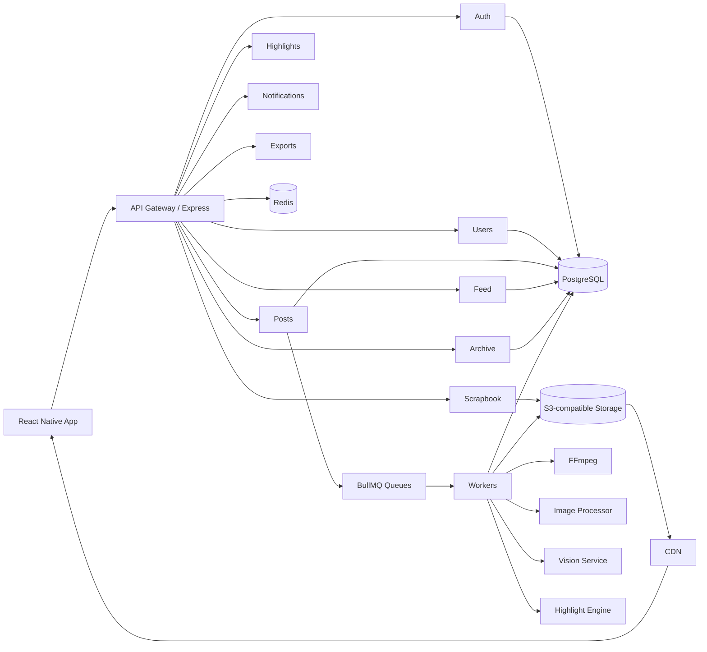

# Architecture

Frames is a pnpm monorepo with a React Native Expo app, an Express API, background workers, shared type/design packages, and a deterministic scrapbook renderer.

The API owns privacy enforcement. Mobile and desktop/web clients share the same backend contracts and never read directly from PostgreSQL or object storage except through signed upload/download URLs.

Current backend launch priorities:

- Auth with refresh-token rotation.
- Friend requests, accepting, blocking, and removal.
- Feed visibility based on active 24-hour posts plus friendship/privacy.
- Private archive and deterministic daily Frame generation.
- Signed upload and confirmation hooks for media workers.
- Share-link records with revocation, expiring links, and password-hash support.
