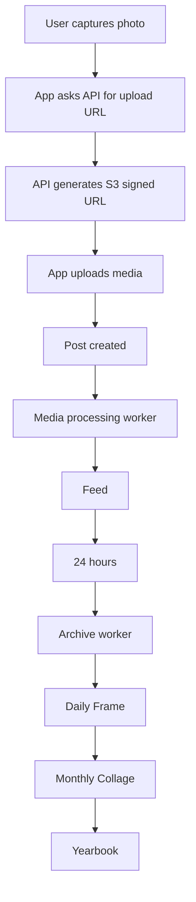

# Posting Data Flow

```mermaid
flowchart TD
  capture[User captures photo] --> presign[App asks API for upload URL]
  presign --> signed[API generates S3 signed URL]
  signed --> upload[App uploads media]
  upload --> post[Post created]
  post --> media[Media processing worker]
  media --> feed[Feed]
  feed --> wait[24 hours]
  wait --> archive[Archive worker]
  archive --> daily[Daily Frame]
  daily --> monthly[Monthly Collage]
  monthly --> yearbook[Yearbook]
```
