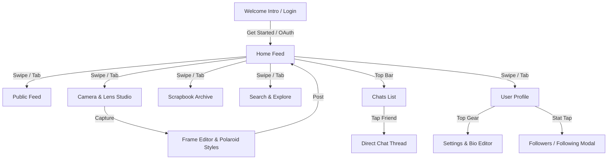

# 📱 Frames App: Complete UI/UX Presentation & Design Specification

This document provides a comprehensive presentation of the **Frames** social scrapbook mobile application for **Stitch** and design enhancement.

---

## 🎨 1. Design System & Brand Identity

### Color Palette Tokens
| Token Name | Hex Code | Purpose | Preview |
| :--- | :--- | :--- | :--- |
| **Paper Cream** | `#F6F0E7` | Primary app background (warm textured paper feel) | `■` `#F6F0E7` |
| **White Paper** | `#FFFFFF` | Card containers, polaroid frames, sheet backgrounds | `■` `#FFFFFF` |
| **Ink** | `#1A1817` | Primary typography, active buttons, dark accents | `■` `#1A1817` |
| **Muted Brown** | `#8C827A` | Subtitles, secondary text, metadata, inactive tabs | `■` `#8C827A` |
| **Sunshine Yellow** | `#F4C443` | Badges, highlights, active lens dots | `■` `#F4C443` |
| **Soft Peach** | `#FDEEE2` | Light card backgrounds, tag pills | `■` `#FDEEE2` |
| **Powder Blue** | `#DCE9F6` | Secondary accents, notebook lines | `■` `#DCE9F6` |
| **Crimson / Danger** | `#B8324A` | Delete actions, liked reaction state | `■` `#B8324A` |

### Typography
- **Headings / Brand**: Heavy modern serif / rounded sans-serif (`font-weight: 900`, tracking: -0.5px)
- **Body / Captions**: Clean legible sans-serif with warm line height (`font-weight: 600–700`, line-height: 1.4)
- **Stamps / Dates**: Monospace uppercase stamped dates (`tracking: 1.5px`)

---

## 🗺️ 2. App Architecture & Screen Flow

---

## 🖼️ 3. Screen-by-Screen UI Specifications

### 1. Home Feed (`/(tabs)/home`)
- **Header**: Brand Logo ("F"), Active Day Date Stamp, Direct Messages button (`💬`), and Notification Bell (`🔔`).
- **Post Cards**:
  - **Polaroid Frame**: Custom tilt (`-1deg` / `1deg`), white border with drop shadow, photo with active lens filter, handwritten-style caption.
  - **Meta Pill**: Remaining feed time (`22h left`) or `★ Pinned on Profile`.
  - **Interactive Reaction Bar**: Heart count, Comment balloon with count, and Forward Arrow (`✈`).
  - **Long-Press Menu (`...`)**: Opens Frame Settings action sheet (*Pin/Unpin*, *Change Privacy*, *Forward*, *Delete*).

### 2. Public Feed (`/(tabs)/feed`)
- Community discovery stream showing only **Public Frames**.
- Automatic filtering: Posts from accounts with `Private Account` enabled are strictly excluded from discovery.

### 3. Camera & Lenses (`/(tabs)/camera`)
- **Viewfinder**: Full-screen 4:3 camera canvas with live viewfinder HUD stamps (`FRAMES 35MM`, date overlay).
- **Interactive Lens Studio**:
  - *Retro Film* (Warm Kodachrome tint)
  - *Cyber Neon* (Vibrant saturation boost)
  - *Golden Hour* (Warm honey amber glow)
  - *VHS Glitch* (Scanline grain & chromatic aura)
  - *Dreamy Bloom* (Soft pastel aesthetic)
  - *Noir Drama* (High-contrast B&W film)
- **Mode Bar**: Clean 2-way toggle between **Photo** (shutter capture) and **Upload** (gallery picker).

### 4. Frame Post Editor (`/editor`)
- Live preview of Polaroid rendering.
- **Frame Templates Carousel**: Classic Polaroid, Filmstrip, Negative Strip, Washi Tape, Torn Paper, Cinema, Stamp.
- **Privacy Selector**: Friends Only vs Public.
- **"Keep on Profile" Switch**: Toggle to pin permanently to the profile grid beyond the 24h feed.

### 5. Scrapbook Archive (`/(tabs)/archive`)
- **Stats Header**: 3-card metric strip (*Days Logged*, *Total Frames*, *★ Pinned Memories*).
- **Filter Switcher**: *All Days*, *★ Pinned*, *This Month*.
- **Day Album Cards**: Date calendar badge (`AUG 19`), moment counters, and multi-photo collage strips with `+N` badge overlays.

### 6. Chats & Forwarding (`/(tabs)/chats` & `/chat/[id]`)
- **Chat Thread**:
  - Header: Friend Avatar, Display Name, Online Presence dot, and Friend Bio Quote.
  - Message Bubbles: Rounded bubbles with distinct mine (`#1A1817`) and theirs (`#FFFFFF`) styling.
  - Status Indicators: `Sent`, `Delivered ✓`, and `Seen ✓✓` read receipts with relative timestamps (`Just now`, `5m ago`).
  - Photo attachments with inline previews.

### 7. User Profile (`/(tabs)/profile`)
- **Header**: Profile Photo, Display Name, `@username`, Bio Status, and Privacy Badge (`🔒 Private` / `🌍 Public`).
- **Stats**: Clean pair of **Followers ›** and **Following ›** stats that open slide-up user connection sheets.
- **Scrapbook Grid**: 3-column square photo tiles featuring active frames and `KEPT` badges for permanently pinned memories.

---

## 🚀 4. Direct APK Download

- **Build Version**: `1.0.0` (Build ID: `a75bd0bf-42be-4cab-9a2b-3b6ce1c091ab`)
- **Direct Download**: [Download Latest Frames.apk](https://expo.dev/artifacts/eas/yqe7CF8lcEsk1uUyxiUWR1JQqtWlvf4rdyaTVon33s4.apk)
